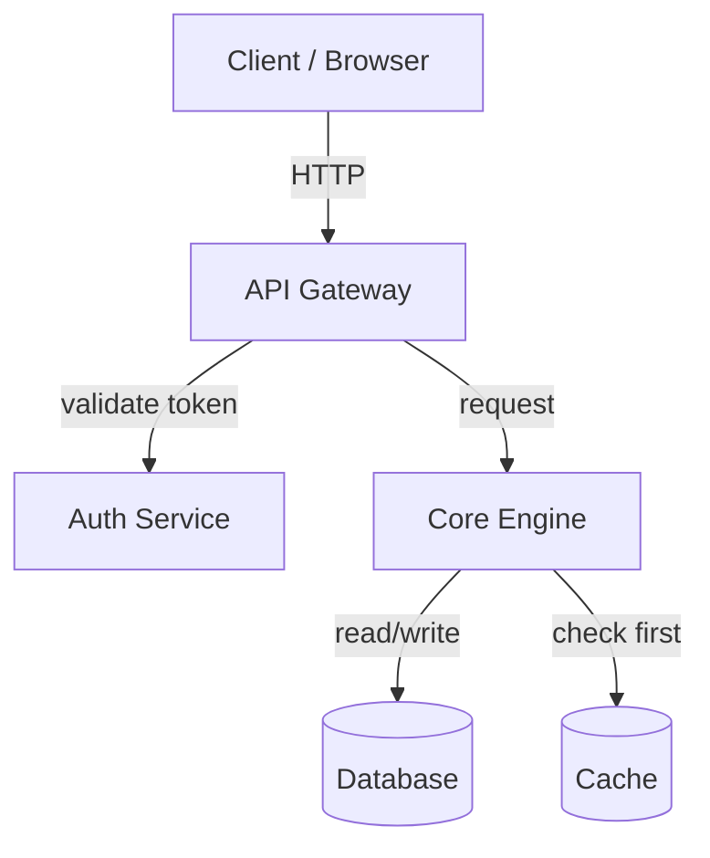
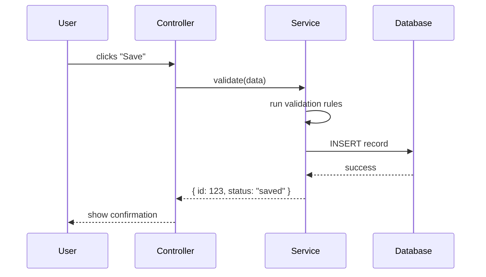
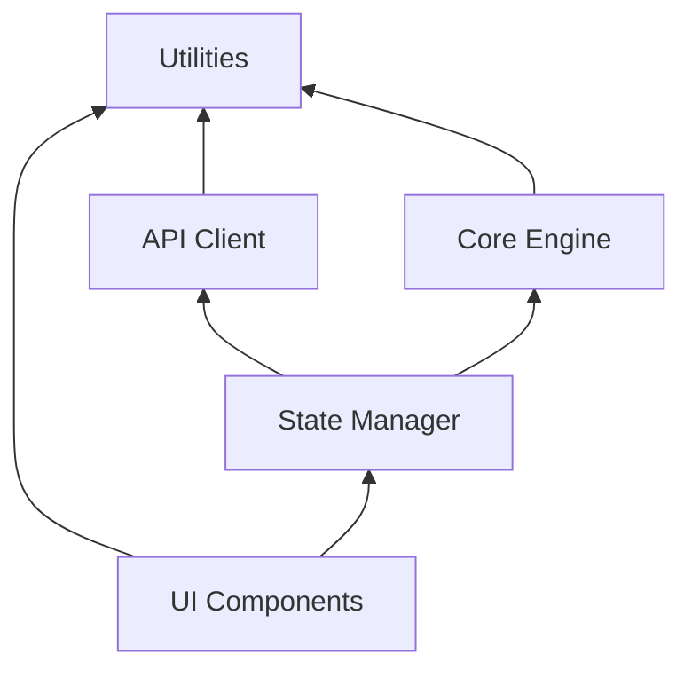

# Diagram Patterns

## When to use which diagram type

| Situation | Diagram type | Mermaid keyword |
|-----------|-------------|-----------------|
| Components and how they connect | Flowchart | `graph TD` or `graph LR` |
| A request/action flowing through components | Sequence diagram | `sequenceDiagram` |
| Module dependencies (who imports whom) | Flowchart | `graph BT` (bottom-to-top) |
| State transitions | State diagram | `stateDiagram-v2` |
| Data transformations through stages | Flowchart | `graph LR` with labeled edges |

## Architecture diagram (flowchart)

Use `graph TD` (top-down) for hierarchical architectures. Use `graph LR` (left-right) when
data flows linearly through a pipeline.

**Rules:**
- Max 8-10 nodes. More than that → split into multiple diagrams.
- Label every arrow with what flows between nodes (HTTP, events, SQL, function call).
- Use shapes consistently: `[rectangles]` for services, `[(cylinders)]` for data stores,
  `{diamonds}` for decisions, `([rounded])` for external systems.
- Group related components with `subgraph` when there are clear boundaries.

## Sequence diagram (data flow)

**Rules:**
- Use `->>` for synchronous calls, `-->>` for responses.
- Use `participant X as Label` to give readable names.
- Label every arrow with the actual function/method name or payload.
- Show error paths with `alt` blocks for the most critical failure case.
- Max 6 participants. More than that → the diagram becomes unreadable.

## Dependency graph

Use `graph BT` (bottom-to-top) so foundational modules sit at the bottom and
higher-level modules sit on top. Arrows point from dependent → dependency
(the direction of `import`).

**Rules:**
- This diagram answers: "If I change module X, what else might break?"
- Modules with many incoming arrows are the core — changes there are high-risk.
- Modules with many outgoing arrows have high coupling — they may be doing too much.
- Don't include every file. Group by module/directory, not individual files.

## Style rules

- **No colors in Mermaid source.** GitHub renders Mermaid with its own theme. Adding
  custom colors often breaks or looks inconsistent.
- **Consistent naming.** If a component is called "AuthService" in one diagram, don't
  call it "Authentication" in another.
- **Whitespace matters.** Add blank lines between participant declarations and message
  flows for readability of the source.
- **Test rendering.** Paste Mermaid blocks into https://mermaid.live to verify they render
  correctly before committing.
